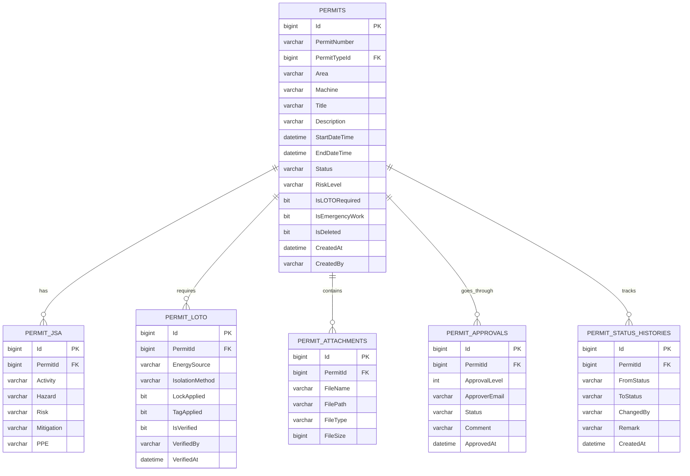
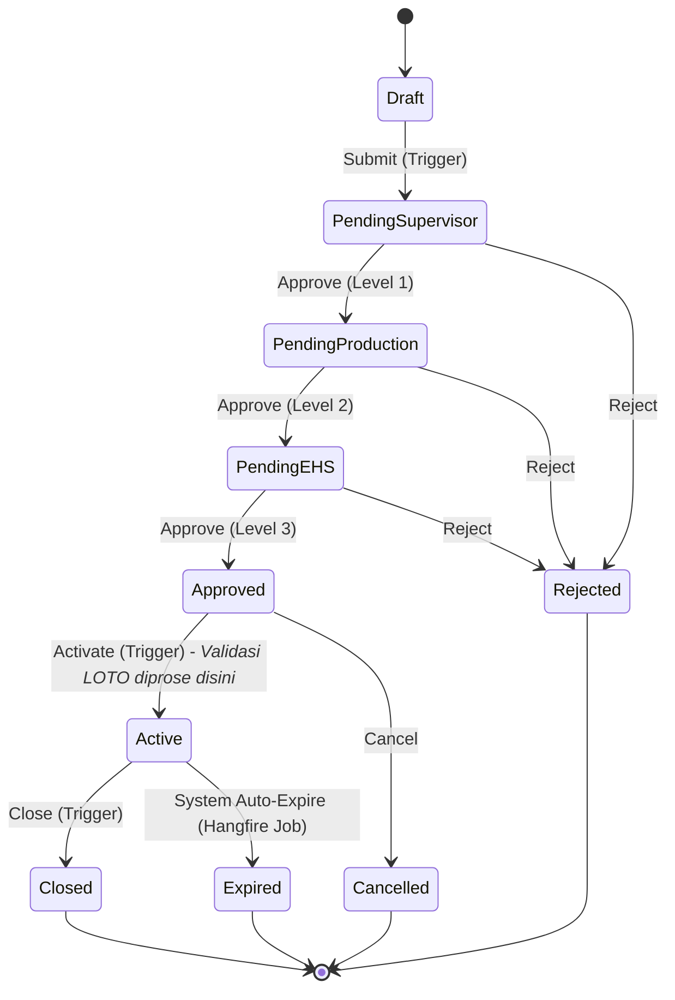

Berikut adalah dokumen **System Design** yang komprehensif dari sistem yang telah kita bangun. Dokumen ini menggunakan format Markdown dan menyertakan diagram (menggunakan Mermaid.js syntax yang sangat mudah dibaca di GitHub/VS Code atau render otomatis di banyak Markdown viewer).

---

# SYSTEM DESIGN DOCUMENT
## Digital Permit To Work (PTW) System

---

## 1. ARCHITECTURE SYSTEM

Sistem dibangun menggunakan prinsip **Clean Architecture** dan **CQRS (Command Query Responsibility Segregation)** untuk memisahkan logika bisnis, akses data, dan presentasi secara ketat.

### 1.1 Architecture Diagram
```text
┌─────────────────────────────────────────────────────────┐
│                     PTW.Web (UI Layer)                  │
│  Razor Pages │ Tailwind CSS │ SignalR Client │ Hangfire │
└───────────────────────────┬─────────────────────────────┘
                            │ HTTP/WebSocket
┌───────────────────────────▼─────────────────────────────┐
│                PTW.Application (Business Layer)          │
│  MediatR (CQRS) │ Validators │ State Machine │ Handlers │
└───────────────────────────┬─────────────────────────────┘
                            │ Dependency Injection
┌───────────────────────────▼─────────────────────────────┐
│               PTW.Domain (Enterprise Core)               │
│          Entities │ Enums │ Interfaces (IFileService)    │
└───────────────────────────┬─────────────────────────────┘
                            │ Implements Interfaces
┌───────────────────────────▼─────────────────────────────┐
│            PTW.Infrastructure (Data Access Layer)        │
│  EF Core DbContext │ Repositories │ Services │ SQL Server│
└─────────────────────────────────────────────────────────┘
```

### 1.2 Key Architectural Decisions
*   **CQRS Pattern (MediatR):** Memisahkan Command (Tulis/Ubah data) dan Query (Baca data) agar kode di Razor Page Model tetap bersih (Thin Controller).
*   **State Machine (Stateless):** Melindungi workflow permit dari transisi ilegal (misal: lompat dari Draft ke Approved).
*   **Domain Events:** Handler mem-publish event `PermitStatusChangedEvent` via MediatR, yang ditangkap oleh SignalR di layer Web untuk push notifikasi realtime.
*   **Soft Delete:** Menggunakan Global Query Filter di EF Core agar data yang dihapus tidak muncul di query, tapi tetap ada di DB untuk audit.

---

## 2. DATABASE DESIGN

Database menggunakan SQL Server dengan konvensi **Audit Columns** wajib pada setiap table utama.

### 2.1 Entity Relationship Diagram (ERD)



### 2.2 Audit Log Structure
Sistem menggunakan dua mekanisme Audit:
1.  **Table Level Audit:** Kolom `CreatedAt`, `CreatedBy`, `UpdatedAt`, `UpdatedBy`, `IsDeleted` pada semua tabel yang inherit dari `BaseEntity`. Diisi otomatis oleh EF Core Interceptor.
2.  **Domain Level Audit (Timeline):** Tabel `PermitStatusHistories` secara spesifik mencatat perpindahan status (Siapa, Kapan, dari status apa, ke status apa, dan remark/alasannya).

---

## 3. WORKFLOW APPROVAL & STATUS PERMIT

Status permit menggunakan Enum berjenis `string` di database untuk keterbacaan, dikontrol ketat oleh **State Machine**.

### 3.1 State Machine Diagram



### 3.2 Approval Hierarchy Matrix

| Approval Level | Role Responsible | Focus Area | System Action |
| :--- | :--- | :--- | :--- |
| **Level 1** | Supervisor | Validasi kebutuhan pekerjaan & risiko. | Status: `PendingSupervisorApproval` → `PendingProductionApproval` |
| **Level 2** | Production | Persetujuan area & shutdown mesin. | Status: `PendingProductionApproval` → `PendingEHSApproval` |
| **Level 3** | EHS / Safety | Validasi akhir, checklist, LOTO. | Status: `PendingEHSApproval` → `Approved` |

---

## 4. API & SERVICE DESIGN

Meskipun menggunakan Razor Pages, logika bisnis diakses melalui **Internal API** berbasis MediatR (CQRS). Semua Request/Response berupa POCO (DTO).

### 4.1 Command API (Write / Mutation)
Semua aksi yang mengubah state data melewati Command.

| Command Name | Trigger | Validasi / Side Effect |
| :--- | :--- | :--- |
| `CreatePermitCommand` | User membuat permit baru | Generate `PermitNumber`, set status `Draft` |
| `UpdatePermitStatusCommand` | Submit, Approve, Reject, Activate, Close | Jalankan **State Machine**, record ke `PermitStatusHistories`, push **SignalR Event** |
| `AddJsaItemCommand` | User menambah baris JSA | Hanya bisa saat status `Draft` |
| `AddLotoItemCommand` | User menambah isolasi LOTO | Hanya bisa saat `Draft` / `Approved` |
| `VerifyLotoItemCommand` | Safety verifikasi LOTO | Update `IsVerified = true`, catat `VerifiedBy` |
| `UploadAttachmentCommand` | User upload foto/PDF | Validasi size (5MB), simpan fisik ke `wwwroot`, simpan path ke DB |
| `ExportPermitPdfQuery` | User klik Download PDF | Generate PDF via QuestPDF + QR Code |

### 4.2 Query API (Read)
Digunakan oleh Razor Page Model untuk me-load data ke UI.

| Query Name | Return Data | Use Case |
| :--- | :--- | :--- |
| `GetPermitListQuery` | `List<PermitListDto>` | Halaman List Permit (Dashboard / Search). Di-filter berdasarkan Role user. |
| `ExportPermitPdfQuery` | `byte[]` | Menghasilkan file PDF untuk di-download browser. |

---

## 5. UI/UX SYSTEM

Menggunakan prinsip **Industrial Modern Minimalist** (Tailwind CSS).

### 5.1 Global Layout Structure
```text
┌────────────┬────────────────────────────────────────────┐
│            │  Top Navbar (Search, User Profile, Live)   │
│  Sidebar   ├────────────────────────────────────────────┤
│  (Deep     │                                            │
│  Blue)     │                                            │
│            │           Main Content Area                │
│ - Dashboard│                                            │
│ - Create   │   (Cards, Tables, Forms, Timeline)         │
│ - List     │                                            │
│ - Approval │                                            │
│ - Admin    │                                            │
│            │                                            │
└────────────┴────────────────────────────────────────────┘
```

### 5.2 Core Pages & Components
1.  **Dashboard:** KPI Cards (Active, Pending, High Risk) + SignalR Live Feed.
2.  **Permit List:** Table with Server-Side Filtering (Status, Area, Role-based data).
3.  **Permit Detail (The Core Page):** Menggunakan section-based layout.
    *   **Work Detail Section:** Informasi dasar pekerjaan + QR Code.
    *   **JSA Section:** Dynamic Table (Add row on the fly).
    *   **LOTO Section:** Table with Verification Toggle (Danger zone - Red accent).
    *   **Attachment Section:** Grid of Photos/PDFs with upload dropzone.
    *   **Workflow & Timeline Section:** Vertical Timeline menampilkan riwayat hidup permit (Audit Trail) dan Action Buttons (Approve/Reject/Activate/Close) yang berubah sesuai State Machine.
4.  **PDF Printout:** Formatted A4 layout via QuestPDF (Header with QR Code, Tables for JSA/LOTO, Signature-like approval block).

---

## 6. INFRASTRUCTURE & CROSS-CUTTING CONCERNS

### 6.1 Background Processing (Hangfire)
*   **Permit Expiration Job:** Berjalan setiap 5 menit (`*/5 * * * *`). Melihat permit `Active` yang `EndDateTime < DateTime.Now`, lalu mentrigger `UpdatePermitStatusCommand` dengan Trigger "Expire".

### 6.2 Realtime Communication (SignalR)
*   **Hub:** `/permitHub`
*   **Event:** `ReceivePermitUpdate` (Mengirim object `PermitId`, `PermitNumber`, `NewStatus`).
*   **Client Action:** Mendengarkan event, jika ada update langsung push notifikasi ke Live Feed Dashboard tanpa full page refresh.

### 6.3 File Storage Strategy
*   **Development/Production:** Local File System di dalam `wwwroot/uploads/permits/{PermitId}/`.
*   **Database:** Hanya menyimpan relative path (`/uploads/permits/.../foto.jpg`) di tabel `PermitAttachments.FilePath`.
*   *(Future-ready untuk pindah ke Azure Blob Storage / NAS dengan hanya mengganti implementasi `IFileService` di Infrastructure layer).*

### 6.4 Logging (Serilog)
*   Menulis log ke Console dan Rolling File (`logs/ptw-log-.txt` per hari).
*   Mencatat semua request HTTP, error exception, dan activity Hangfire.
